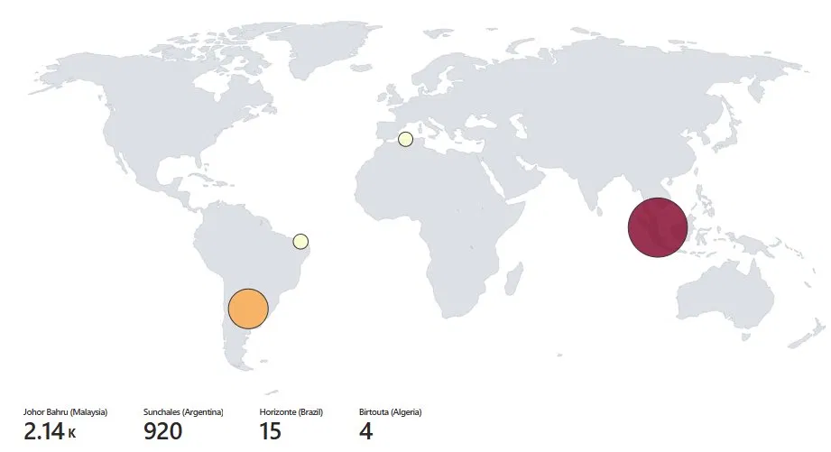
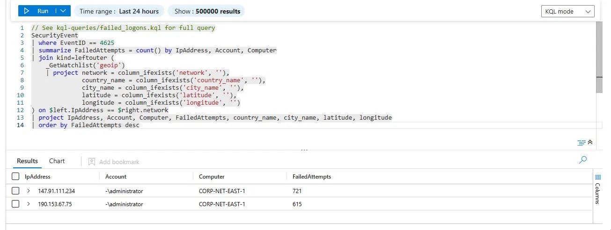

# Azure SOC Honeypot Lab


**A hands-on Azure SIEM lab demonstrating real-world threat detection, brute-force attack monitoring, and SOC operational workflows using Microsoft Sentinel and KQL.**

---

## 🏗️ Architecture


---

## 🎯 Overview

This lab deploys an intentionally vulnerable Azure VM (honeypot) to the public internet, monitors failed RDP/SSH brute-force attempts, enriches events with geolocation data, and visualizes attack origins on an interactive map within Microsoft Sentinel.

**Perfect for:**
- Security+ Domain 4 (Security Operations) certification prep
- SIEM platform hands-on experience
- Understanding real-world SOC workflows
- Learning KQL (Kusto Query Language)

---

## 🎓 Learning Objectives

- ✅ Deploy an intentionally vulnerable Azure VM honeypot exposed to live internet brute-force traffic
- ✅ Ingest Windows Security Event logs (EventID 4625) into Log Analytics Workspace
- ✅ Enrich failed logon events with geolocation data using custom GeoIP watchlist
- ✅ Build advanced KQL queries to detect and aggregate attack patterns
- ✅ Visualize threat intelligence on geographic maps
- ✅ Configure Sentinel analytics rules and incident workflows
- ✅ Understand SOC detection, investigation, and response processes

---

## 📸 Screenshots

### Azure Resource Deployment

*Complete Azure resource group with honeypot VM, Log Analytics Workspace, and Sentinel instance.*

### Attack Map — Live Threat Visualization

*Global map showing attack origins by country — geolocation data enriched from GeoIP watchlist.*

### KQL Query Results — Enriched Threat Data

*Failed logon events (EventID 4625) joined with GeoIP data showing attacker IPs, countries, cities, and failed attempt counts.*

---

## ⚡ Quick Start

### Prerequisites
- Azure Subscription (free or PAYG) — **~$170–200/month estimated**
- Azure CLI or Portal access
- PowerShell 7+
- ~45–60 minutes setup time

### Setup Phases (7 Steps)

1. **Provision Azure VM** — Deploy Windows VM with all inbound ports open
2. **Create Log Analytics Workspace** — Central log repository
3. **Deploy Microsoft Sentinel** — Attach SIEM to workspace
4. **Upload GeoIP Watchlist** — Map IP addresses to countries/cities
5. **Write KQL Detection Queries** — Query SecurityEvent table for EventID 4625
6. **Build Attack Map Workbook** — Visualize attacker origins globally
7. **Monitor Live Attacks** — Observe brute-force attempts in real-time

**→ [Full Setup Guide](docs/SETUP.md)**

---

## 📊 Key KQL Queries

### Failed RDP Logons Enriched with GeoIP

```kql
SecurityEvent
| where EventID == 4625
| summarize FailedAttempts = count() by IpAddress, Account, Computer
| join kind=leftouter (
    _GetWatchlist('geoip')
    | project network = column_ifexists('network', ''),
              country_name = column_ifexists('country_name', ''),
              city_name = column_ifexists('city_name', ''),
              latitude = column_ifexists('latitude', ''),
              longitude = column_ifexists('longitude', '')
) on $left.IpAddress == $right.network
| project IpAddress, Account, Computer, FailedAttempts, country_name, city_name, latitude, longitude
| order by FailedAttempts desc
```

→ [View All Query Examples](kql-queries/failed_logons.kql)

---

## 🛠️ Skills Demonstrated

| Skill | Tool / Technique | Security+ Domain |
|---|---|---|
| **Threat Detection & Monitoring** | Microsoft Sentinel, KQL | Domain 4 — Security Operations |
| **Log Analysis** | Log Analytics Workspace, SecurityEvent table | Domain 4 — Security Operations |
| **Threat Intelligence** | GeoIP Watchlist, Attack Map Visualization | Domain 1 — General Security Concepts |
| **Network Security** | Azure NSG rules, Honeypot deployment | Domain 1 — General Security Concepts |
| **Incident Identification** | EventID 4625, Brute-force pattern detection | Domain 4 — Security Operations |
| **SIEM Administration** | Sentinel Workbooks, Analytics Rules, DCR | Domain 4 — Security Operations |
| **Cloud Security** | Azure VM hardening, access controls | Domain 3 — Architecture & Design |

---

## 💡 Key Lessons Learned

Exposing a cloud VM to the public internet results in **brute-force attempts within minutes**, demonstrating how pervasive automated credential-stuffing attacks are in the wild. 

**Critical takeaways:**
- Real attackers scan 24/7 using botnets and scripted tools
- Geographic diversity of attacks highlights global threat landscape
- Proper SIEM tuning reduces false positives while catching real threats
- Log retention and enrichment are essential for investigation quality
- Cloud costs escalate quickly with high-volume ingestion — monitor carefully

---

## 📁 Repository Structure

```
azure-soc-honeypot/
├── README.md                          ← You are here
├── docs/
│   ├── SETUP.md                       ← Complete step-by-step guide
│   └── TROUBLESHOOTING.md             ← Common issues & solutions
├── kql-queries/
│   └── failed_logons.kql              ← 10+ query examples
├── screenshots/
│   ├── system architecture.png        ← Architecture diagram
│   ├── attack-map.webp                ← Live threat map
│   ├── kql-results.webp               ← Query output
│   └── resource group.webp            ← Azure deployment
├── LICENSE                            ← MIT License
├── CONTRIBUTING.md                    ← Contribution guidelines
└── .gitignore                         ← Git exclusions
```

---

## 🚀 Getting Started

### Option 1: Guided Setup (Recommended)
Follow [docs/SETUP.md](docs/SETUP.md) step-by-step with all Azure CLI commands and configuration details.

### Option 2: Azure Portal GUI
1. Create resource group → VM → Log Analytics → Sentinel
2. Manually configure each service (longer but more visual)

### Option 3: Infrastructure as Code
Use Azure Bicep or Terraform templates (coming soon)

---

## 📚 Resources

- [Microsoft Sentinel Documentation](https://learn.microsoft.com/en-us/azure/sentinel/)
- [KQL Query Language Reference](https://learn.microsoft.com/en-us/azure/data-explorer/kusto/query/)
- [Azure VM Security Best Practices](https://learn.microsoft.com/en-us/azure/virtual-machines/security-policy)
- [CompTIA Security+ Domain 4](https://www.comptia.org/certifications/security)
- [MITRE ATT&CK Framework](https://attack.mitre.org/)

---

## ⚠️ Cost Management

| Service | Estimated Cost |
|---|---|
| Windows VM (B2s, 730 hrs/month) | $20–50 |
| Log Analytics (ingestion, ~50GB) | $50–100 |
| Microsoft Sentinel (100GB ingest) | $100+ |
| **Total** | **$170–200/month** |

**Cost-saving tips:**
- Delete resource group when not in use: `az group delete --name rg-honeypot-lab`
- Use smaller VM size (B1s) if costs exceed budget
- Stop (deallocate) VM during off-hours — pay only for storage

---

## 🐛 Troubleshooting

**No events appearing?**
- Verify inbound NSG rule allows all traffic (port 0-65535)
- Check Windows Event Viewer on VM for EventID 4625
- Confirm Log Analytics Agent running: `Get-Service HealthService`

**GeoIP Watchlist not joining?**
- Verify watchlist name is `geoip`
- Test with: `_GetWatchlist('geoip') | take 5`
- Ensure network format matches query join condition

**High latency in map visualization?**
- Reduce time range in query
- Aggregate by country instead of city for faster rendering

→ [Full Troubleshooting Guide](docs/TROUBLESHOOTING.md)

---

## 🤝 Contributing

Found an issue or want to add KQL queries, automation scripts, or improved documentation?

→ [See CONTRIBUTING.md](CONTRIBUTING.md)

---

## 📄 License

MIT License — See [LICENSE](LICENSE) for details.

---

## 🎯 Next Steps

1. **Deploy the lab** — Follow [SETUP.md](docs/SETUP.md)
2. **Generate attacks** — Use Hydra or custom scripts to trigger brute-force attempts
3. **Explore queries** — Modify KQL queries in `kql-queries/` for custom detections
4. **Extend monitoring** — Add PowerShell, DNS, or web app logs
5. **Build SOC skills** — Practice incident response and triage workflows

---

**Questions?** Open a [GitHub Issue](https://github.com/cyr6x/azure-soc-honeypot/issues) or start a Discussion.

**Happy hunting!** 🎯🗺️
